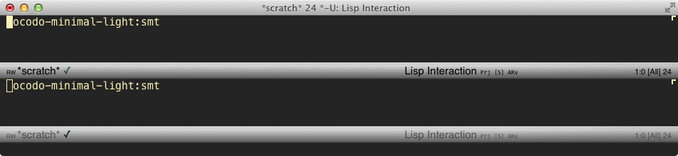
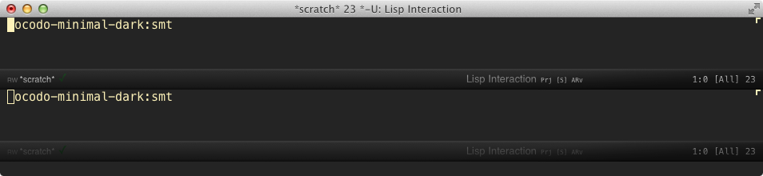
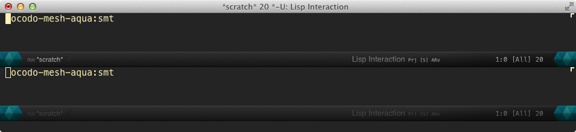
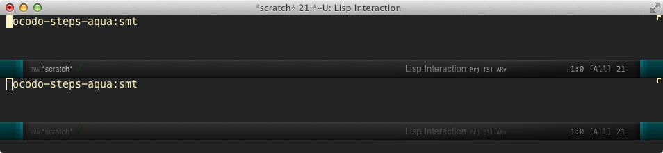

# Ocodo SVG modelines

### Version 0.1.1

Upgrade notes:

External png and svg images are now loaded as data uri
(image/png,base64 and xml/svg,utf8.) This will allow the modelines to
function fully on any Emacs build which has image-svg
support. (ie. `--with-librsvg` configured builds)

This won't affect OS X/Emacs Mac Port users, who will already be
enjoying full svg support.

# Abstract

A completely superfluous, but otherwise most excellent collection
of awesome modelines... if not now, then at some point in the
future, you might want, need and maybe even love these.

Don't worry if this isn't true, it's just promotional bullshit.

Very much a work in progress, these modelines are relatively
sparse, however, any info or widgets you'd like to have, please
post an issue on the github repository
https://github.com/ocodo/ocodo-svg-modelines/issues and I'll
attempt to cater to you.

## What have I got for you so far?

Each modeline currently features

- file state (rw/ro)
- buffer filename
- saved/unsaved state
- Major mode
- VC/Git branch
- Minor modes (filtered)
- line:col
- vertical position percentage
- file size

See roadmap for a few ideas on the direction of the project...

Anyway, without further ado, aside from this droning preamble, here's the
modeline designs I have for you so far.

### ocodo-kawaii-light:smt

### ocodo-minimal-light:smt

### ocodo-minimal-dark:smt

### ocodo-mesh-grass:smt

### ocodo-mesh-aqua:smt

### ocodo-steps-grass:smt

### ocodo-steps-aqua:smt

## Roadmap

Direction partly depends on community feedback, however I have my own
desires and wishes for this project, obviously. Top of my list is
minor and major mode displays being more graphical, although I think
these will be more experimental.

I'd like to see an icon which describes the Major mode, and minor modes.

Also:

- Time would be nice to see as an analog graphical clock icon, which is relatively easy to achieve.

- Date shown as a calendar page icon.

- Version control state of the file shown graphically (some experimental stuff exists for this already.)

- File file state info shown graphically (saved/unsaved changes are already shown by a splat and a checkmark)

- I'm sure you can think of plenty more.

## Installation

Manual installation is necessary at the moment. Package installation
via MELPA will be available soon (a few days from now: 2015-05-10
8:55AM UTC+0800)

Follow these steps:

    wget https://github.com/ocodo/ocodo-svg-modelines/archive/0.1.1.tar.gz
    gunzip 0.1.1.tar.gz
    mv 0.1.1.tar ~/ocodo-svg-modelines-0.1.1.tar

Subsequently, from Emacs:

    M-x package-install <RET> svg-mode-line-themes
    M-x package-install-file <RET> ~/ocodo-svg-modelines-0.1.1.tar

## Usage

    M-x ocodo-svg-modelines/init

    M-x smt/set-theme

You can then select one of the ocodo themes listed above.

## Caveat Emptor

Please note this package is quite experimental and full SVG
functionality isn't available on all Emacs builds.

If you are on OS X, I recommend you use the Emacs Mac Port build, it
is available via `brew`. It uses webkit to render SVG, so SVG support
is first class.

    brew tap railwaycat/emacsmacport
    brew install emacs-mac

Visit https://github.com/railwaycat/homebrew-emacsmacport for more info.

Emacs homebrew builds which are not Emacs-Mac-Port will function as the Linux
builds described below.

## Problems or Suggestions

If you have problems using these modelines, please check the issues at
https://github.com/ocodo/ocodo-svg-modelines/issues and post a new one
as needed.  I will do my best to get fixes and help to you.

If you have feature requests or other suggestions, or if you plain
don't like this package, please go ahead and post issues too.

## Forks and Contributions

If you would like to make your own svg modelines using these as a
base, please go ahead and fork it, strip out the ocodo modelines if
you're going to publish.

Contributions are very welcome, please go ahead, fork, branch and pull
request anything you'd like to add.

## Additions to the smt core

This package relies on Sabof's svg-mode-line-themes.  Core
functionality for these themes is developed there.

https://github.com/sabof/svg-mode-line-themes

---
Converted from `ocodo-svg-modelines.el` by [*el2markdown*](https://github.com/Lindydancer/el2markdown).
